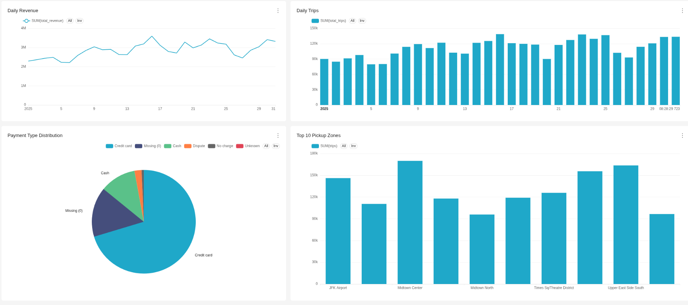

# Отчёт: NYC Yellow Taxi Analytics

**Данные:** NYC Yellow Taxi, январь 2025 (~3.47 млн поездок)

---

## 1. Архитектура

```
yellow_tripdata_2025-01.parquet
        │
        ▼
insert_data_2025.py  (pandas + PyArrow + SQLAlchemy)
        │
        ▼
PostgreSQL (staging)          main_postgres :5432
  таблица: yellow_taxi_trips
        │
        ▼  Airflow DAG: transfer_postgres_to_clickhouse
ClickHouse (OLAP)             main_clickhouse :8123
  fact_taxi_trips               — сырые поездки
  taxi_daily_metrics            — витрина по дням
  dq_log                        — журнал DQ-проверок
        │
        ▼
Superset :8088                  — дашборд NYC Taxi — January 2025
```

| Компонент | Роль |
|-----------|------|
| **PostgreSQL** | staging: первичная загрузка parquet, удобно через pandas |
| **ClickHouse** | OLAP: быстрые агрегации на миллионах строк (колоночное хранение) |
| **Airflow** | оркестрация: расписание, цепочка задач, перезапуск без поломки данных |
| **Superset** | BI: дашборды и графики поверх ClickHouse |
| **Docker Compose** | все сервисы поднимаются одной командой, данные в томах |

### Поток данных

**1. parquet → Postgres** (`insert_data_2025.py`)

- Читает `yellow_tripdata_2025-01.parquet` батчами по 100 000 строк (PyArrow) — не загружает весь файл в память сразу.
- Пишет в `yellow_taxi_trips` через SQLAlchemy (`to_sql`).
- Первый батч — `replace` (создаёт таблицу), остальные — `append`.
- Креды Postgres берутся из `.env`.

**2. Postgres → ClickHouse** (DAG `transfer_postgres_to_clickhouse`)

- `DROP PARTITION` за день — перед загрузкой удаляется партиция за этот день в `fact_taxi_trips`. Если DAG перезапустить, дубликатов не будет (идемпотентность).
- `INSERT ... SELECT FROM postgresql(...)` — ClickHouse напрямую читает из Postgres через встроенную table function, без промежуточного файла.
- Фильтр `WHERE toDate(tpep_pickup_datetime) = '{{ ds }}'` — за один запуск DAG грузится ровно один день.
- Таблица партиционирована по `toYYYYMMDD(tpep_pickup_datetime)` — каждый день января = отдельная партиция на диске.

**3. Витрина метрик** (DAG `taxi_metrics_incremental_load`)

- Смотрит `MAX(report_date)` в `taxi_daily_metrics` и `MAX(toDate(...))` в `fact_taxi_trips`.
- Если сырые данные «впереди» витрины — догружает до 5 дней за один запуск.
- Считает `count(*)` и `sum(total_amount)` по дням → `taxi_daily_metrics`.
- После завершения триггерит DAG проверок качества.

**4. Data Quality** (DAG `data_quality_checks`)

| Проверка | Что проверяет |
|----------|---------------|
| `negative_revenue` | нет отрицательной выручки в витрине |
| `null_date` | нет пустых `report_date` |
| `duplicate_date` | нет дублей по дате |
| `zero_trips` | нет дней с нулём поездок |
| `volume_drop_50_pct` | нет падения объёма >50% день к дню |

Результаты пишутся в `dq_log` (статус `SUCCESS` / `FAIL`).

**5. Визуализация** — Superset подключается к ClickHouse и строит чарты на `taxi_daily_metrics`, `fact_taxi_trips` и SQL-датасетах.

---

## 2. Решения

### Postgres как staging, ClickHouse как warehouse

Postgres хорош для «положить сырые данные» (pandas, транзакции, простой `to_sql`). ClickHouse — для аналитики: `GROUP BY` на 3.5M строк выполняется быстро за счёт колоночного формата и партиций. Это типичная схема landing → warehouse, а не «всё сразу в ClickHouse».

### Идемпотентность ETL

Без `DROP PARTITION` повторный запуск DAG за тот же день добавил бы строки второй раз. Схема «удалить партицию → вставить заново» даёт тот же результат, что и один успешный прогон.

### Инкрементальная витрина вместо полного пересчёта

Полный `INSERT ... SELECT ... GROUP BY` за весь месяц при каждом запуске избыточен. DAG догоняет только новые дни — экономит время и нагрузку на ClickHouse.

### DDL в репозитории

Таблицы ClickHouse описаны в `sql/ddl/clickhouse/` — проект можно развернуть с нуля, не восстанавливая схему из памяти или DBeaver.

### Секреты в `.env`

Пароли и ключи — в `.env` (не в git). В репозитории только `.env.example` с заглушками `change_me`. DAG-и и `insert_data_2025.py` читают креды из переменных окружения.

### Docker: два Postgres

- `main_postgres` — данные такси (`yellow_taxi_trips`).
- `airflow-postgres` — служебная БД Airflow (расписание, история запусков).

Сервис Airflow Postgres переименован в `airflow-postgres`, чтобы в общей Docker-сети `databases_default` не было конфликта DNS-имени `postgres`.

### Superset + ClickHouse

Драйвер `clickhouse-connect` ставится при старте контейнера в persistent volume (`superset_home`). Подключение из Superset: host `clickhouse` (имя сервиса в compose), port `8123`, database `default`.

### Дашборд: читаемые зоны

Bar chart по `PULocationID` показывает только цифры (138, 236…). Решение — SQL-датасет с `JOIN taxi_zones`, на графике названия: JFK Airport, Midtown и т.д.

---

## 3. Бенчмарки

**Бенчмарк** — сравнение «до» и «после» оптимизации на одних данных: сколько строк/партиций читает запрос, сколько времени выполняется.

Скрипты: `sql/optimizations/`. Замеры: `EXPLAIN ESTIMATE` и время в DBeaver.

### Кейс 1. Bloom-filter skip index

**Файл:** `01_skip_index.sql`  
**Задача:** найти редкие поездки `PULocationID = 206`.

- **До:** full scan — ClickHouse читает все гранулы таблицы.
- **После:** `ADD INDEX ... TYPE bloom_filter()` + `MATERIALIZE INDEX` — для каждой гранулы хранится «есть ли здесь 206», лишние гранулы пропускаются.

| | До | После |
|---|-----|-------|
| Метод | full scan | bloom-filter skip index |
| Партиций (parts) | 31 | 7 |
| Строк к чтению (rows) | 253 952 | 57 344 |
| Гранул (marks) | 31 | 7 |

### Кейс 2. Partition pruning

**Файл:** `02_partition.sql`  
**Задача:** `sum(total_amount)` за 15.01.2025.

- **До:** `formatDateTime(tpep_pickup_datetime, ...) = '2025-01-15'` — функция на колонке, оптимизатор не может сопоставить с ключом партиции → читаются все партиции января.
- **После:** `toDate(tpep_pickup_datetime) = '2025-01-15'` — совпадает с ключом партиционирования → читается одна партиция `20250115`.

| | До | После |
|---|-----|-------|
| Условие | `formatDateTime(...)` | `toDate(...)` |
| Партиций (parts) | 31 | 1 |
| Строк к чтению (rows) | 3 475 204 | 126 388 |
| Гранул (marks) | 425 | 16 |

### Кейс 3. Query result cache

**Файл:** `03_cache.sql`  
**Задача:** топ-10 маршрутов `(PULocationID, DOLocationID)`.

- **До:** каждый запуск — полный пересчёт `GROUP BY` на миллионах строк.
- **После:** `SETTINGS use_query_cache = 1` — повторный идентичный запрос (как в дашборде) возвращается из кэша.

| Запуск | Настройка | Время |
|--------|-----------|-------|
| 1-й (без кэша) | без `SETTINGS` | **0,102 с** |
| 2-й (кэш заполняется) | `use_query_cache = 1` | **0,063 с** |
| 3-й (из кэша) | `use_query_cache = 1` | **0,011 с** |

Для сравнения в отчёте: **до** = 1-й запуск (102 мс), **после** = 3-й запуск (11 мс) — ускорение примерно в **9 раз**.

### Кейс 4. Materialized View + POPULATE

**Файл:** `04_populate.sql`  
**Задача:** выручка по часам.

- **До:** каждый раз `GROUP BY toStartOfHour(...)` по `fact_taxi_trips` (~3.5M строк).
- **После:** `CREATE MATERIALIZED VIEW ... ENGINE = SummingMergeTree() ... POPULATE` — агрегаты предрасчитаны, чтение из `mv_hourly` (~768 строк за месяц).

| | До | После |
|---|-----|-------|
| Источник | `fact_taxi_trips` | `mv_hourly` |
| Партиций (parts) | 31 | 2 |
| Строк к чтению (rows) | 3 475 204 | 768 |
| Гранул (marks) | 425 | 2 |

> `CREATE MATERIALIZED VIEW` выдал `TABLE_ALREADY_EXISTS` — витрина была создана ранее, это нормально. Для замера «после» достаточно `EXPLAIN ESTIMATE` по `mv_hourly`.

### Кейс 5. Параллелизм

**Файл:** `05_parallel_processing.sql`  
**Задача:** `GROUP BY payment_type`, `sum(tip_amount)`.

- **До:** `SETTINGS max_threads = 1` — один поток CPU (`MergeTreeSelect ... x 31 -> 1` в плане).
- **После:** по умолчанию — ClickHouse использует **12 потоков** (`ExpressionTransform x 12`, `MergeTreeSelect ... Thread) x 12`).

| | `max_threads = 1` | по умолчанию (12 потоков) |
|---|-------------------|---------------------------|
| Время выполнения | **0,175 с** | **0,035 с** |
| Ускорение | — | ~**5×** |

---

## 4. Дашборд

**Название:** `NYC Taxi — January 2025`

| Чарт | Тип | Данные |
|------|-----|--------|
| Daily Revenue | Line | `taxi_daily_metrics`, `SUM(total_revenue)` по дням |
| Daily Trips | Bar | `taxi_daily_metrics`, `SUM(total_trips)` по дням |
| Top 10 Pickup Zones | Bar | SQL-датасет: `fact_taxi_trips` + `taxi_zones` |
| Payment Type Distribution | Pie | `fact_taxi_trips`, `COUNT(*)` по `payment_type` |



---

## 5. Инсайты

1. **Объём** — ~3.47 млн поездок за январь 2025.
2. **География** — в топе JFK Airport, Midtown Center, Times Square: аэропорты и центр Manhattan.
3. **Оплата** — основная доля у карт (`payment_type = 1`).
4. **Качество источника** — ~15% записей с `payment_type = 0`: в справочнике TLC такого типа нет, это пропуски в сырых данных.
5. **DQ** — все проверки в `dq_log` завершились со статусом `SUCCESS`.
